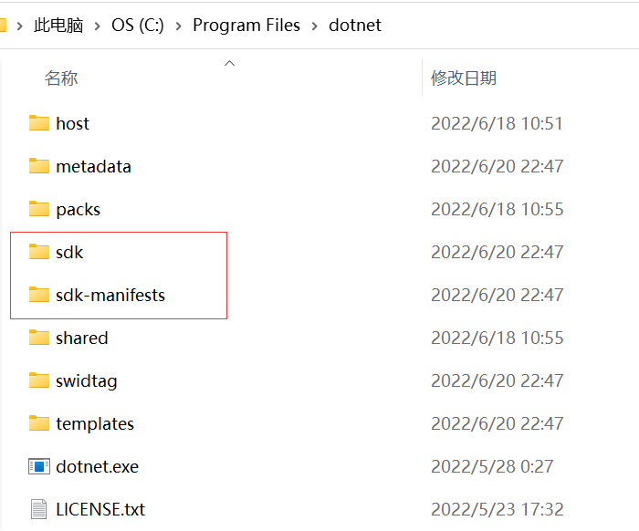
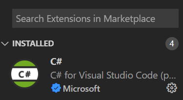
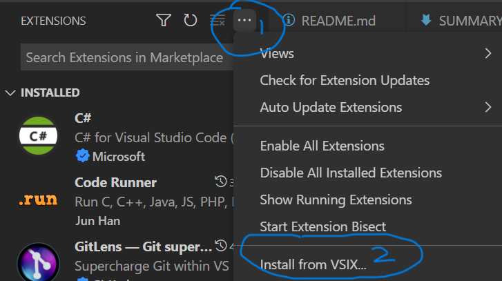
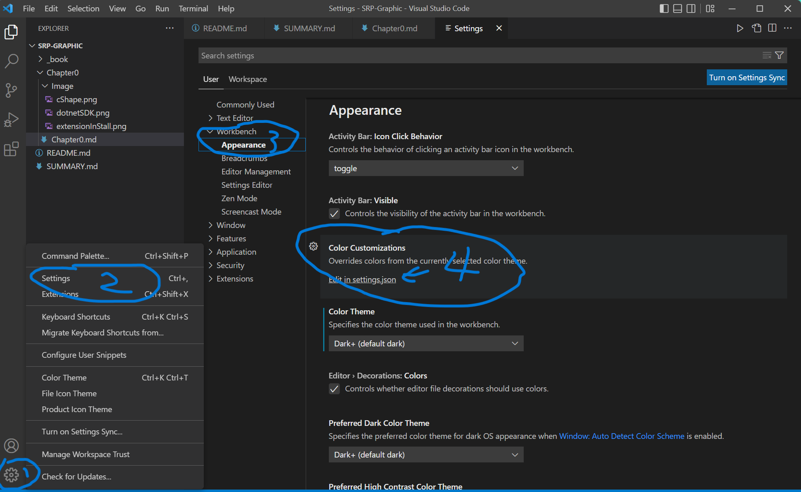
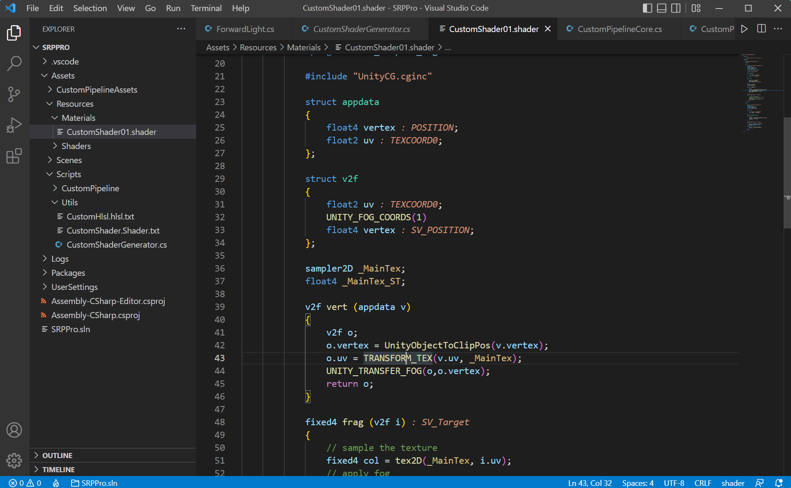

# 第 0 章   SRP环境配置

### 2.VSCode环境配置

一个好用的code环境必不可少，不喜欢免费的可以选择JetBrains的Rider是专门为Unity制作的code软件。个人还是喜欢VSCode，就必须要为VSCode搭建好舒适的环境。

##### 2.1.C#环境的搭建

- 首先在MicroSoft下载个[dotnet sdk](https://dotnet.microsoft.com/zh-cn/download),.NET 提供一组标准的基类库和 API，这些库和 API 对所有 .NET 应用程序都是通用的。一定是 dotnet sdk而不是dotnet，下载安装完打开安装路径，一定要有sdk文件夹。


- 在VSCode插件中下载C#插件


- C#的code环境已经搭建好
此时对于C#的代码就已经有了语法补全，代码高亮，语义高亮，悬停提示，定义跳转的功能

##### 2.2.Shader环境的搭建

VSCode中并没有很好支持Unity的Shader插件，所以我就自己做了个VSCode的插件，[插件下载地址]()目前只是第1版，只支持代码高亮，语法补全，简单的悬停提示和定义跳转的功能。

- 下载完后，在VSCode插件中安装



- Settings.json配置
由于个人能力原因，设置高亮的颜色还不太会在插件中设置，只好用这样的方式。如果知道如何在插件中设置颜色，请及时联系某，某不胜感激
打开Settings.json



 复制如下代码
```json
{
    "workbench.colorTheme": "Default Dark+",
    "security.workspace.trust.untrustedFiles": "open",
    "editor.tokenColorCustomizations": {
        "[Default Dark+]": {
            "textMateRules": [
                {
                "scope": "unity.variables",
                "settings": {
                "foreground": "#45bae8",
                "fontStyle": "italic"
                }
                },
                {
                "scope": "unity.class",
                "settings": {
                "foreground": "#4EC9B0",
                "fontStyle": "italic"
                }
                },
                {
                "scope": "unity.constant",
                "settings": {
                "foreground": "#CE9178",
                "fontStyle": "italic"
                }
                },
                {
                "scope": "unity.properties",
                "settings": {
                "foreground": "#d7ba7d"
                }
                },
                {
                "scope": "shader.keywords",
                "settings": {
                "foreground": "#45bae8",
                }
                },
                {
                "scope": "shader.variables",
                "settings": {
                "foreground": "#9CDCFE",
                }
                },
                {
                "scope": "shader.function",
                "settings": {
                "foreground": "#DCDCAA",
                }
                },
                {
                "scope": "shader.class",
                "settings": {
                "foreground": "#4EC9B0",
                }
                },
                {
                "scope": "shader.constant",
                "settings": {
                "foreground": "#CE9178",
                }
                },
                {
                "scope": "unity.properties",
                "settings": {
                "foreground": "#d7ba7d"
                }
                },
                {
                "scope": "shader.control",
                "settings": {
                "foreground": "#C586C0",
                }
                },
                ],
               
        }
    },
}
```
- Shader插件安装完后，打开一个Shader文件


 Shader插件安装完成
