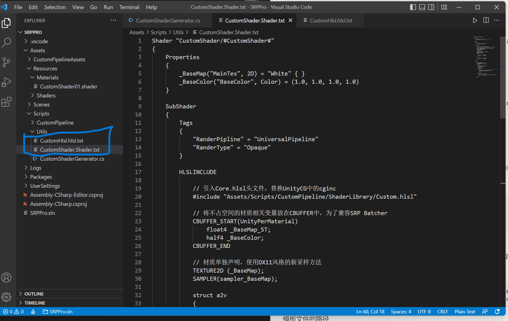
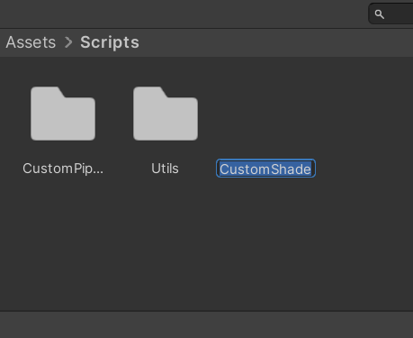
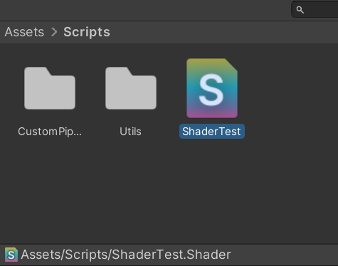

# 第 0 章   SRP环境配置

### 3.其他的配置

shader的语言主要是hlsl，而shader生成的默认模板为cg语言的，没有生成cg的shader的文件，也没有生成hlsl的文件，因此
配了一些脚本能生产hlsl的模板shader，和生成hlsl的文件

生成shader和hlsl的脚本

``` cs
using System.IO;
using System.Text.RegularExpressions;
using UnityEditor.ProjectWindowCallback;
using UnityEngine;
using UnityEditor;

public class CustomShaderGenerator
{
    const string k_CustomShaderPath = "Assets/Scripts/Utils/CustomShader.Shader.txt";
    const string k_CustomHlslPath = "Assets/Scripts/Utils/CustomHlsl.hlsl.txt";

    [MenuItem("Assets/Create/Shader/Custom Shader")]
    public static void GenerateShader()
    {
        var targetObj = Selection.objects[0];
        string targetPath = AssetDatabase.GetAssetPath(targetObj);

        if(File.Exists(targetPath))
        {
            targetPath = Path.GetDirectoryName(targetPath); 
        }

        ProjectWindowUtil.StartNameEditingIfProjectWindowExists(
            0,
            ScriptableObject.CreateInstance<CreateScriptAsset>(),
            targetPath + "/CustomShader.Shader",
            null,
            k_CustomShaderPath
        );
        
    }
    [MenuItem("Assets/Create/Shader/Custom hlsl")]
    public static void GenerateHLSL()
    {
        var targetObj = Selection.objects[0];
        string targetPath = AssetDatabase.GetAssetPath(targetObj);

        if(File.Exists(targetPath))
        {
            targetPath = Path.GetDirectoryName(targetPath); 
        }

        ProjectWindowUtil.StartNameEditingIfProjectWindowExists(
            0,
            ScriptableObject.CreateInstance<CreateScriptAsset>(),
            targetPath + "/CustomHlsl.hlsl",
            null,
            k_CustomHlslPath
        );

    }
}
class CreateScriptAsset : EndNameEditAction
{
    public override void Action(int instanceId, string pathName, string resourceFile)
    {
        UnityEngine.Object obj = CreateTemplateScriptAsset(pathName,resourceFile);
        ProjectWindowUtil.ShowCreatedAsset(obj);
    }

    public UnityEngine.Object CreateTemplateScriptAsset(string newScriptPath,string targetPath)
    {
        string fullPath = Path.GetFullPath(newScriptPath);
        string fileNameWithoutExtension = Path.GetFileNameWithoutExtension(newScriptPath);
        string item = "#CustomShader#";
        if(targetPath.Contains("hlsl"))
        {
            item = "#HLSL#";
            fileNameWithoutExtension = fileNameWithoutExtension.ToUpper();
        }
        
        using (StreamWriter sw = new StreamWriter(fullPath,true,System.Text.Encoding.UTF8))
        {
            using (StreamReader sr = new StreamReader(targetPath))
            {
                string str = sr.ReadToEnd();
                str = Regex.Replace(str,item,fileNameWithoutExtension);
                sw.Write(str);
                sw.Close();
                sr.Close();
                AssetDatabase.Refresh();
                AssetDatabase.ImportAsset(newScriptPath);
                return AssetDatabase.LoadAssetAtPath(newScriptPath,typeof(UnityEngine.Object));
            }
            
        }
    }
}
```
shader的模板文件 CustomShader.Shader.txt

``` glsl
Shader "CustomShader/#CustomShader#"
{
    Properties
    {
        _BaseMap("MainTex", 2D) = "White" { }
        _BaseColor("BaseColor", Color) = (1.0, 1.0, 1.0, 1.0)
    }

    SubShader
    {
        Tags
        {
            "RanderPipline" = "UniversalPipeline"
            "RanderType" = "Opaque"
        }

        HLSLINCLUDE

            // 引入Core.hlsl头文件，替换UnityCG中的cginc
            #include "Assets/Scripts/CustomPipeline/ShaderLibrary/Custom.hlsl"

            // 将不占空间的材质相关变量放在CBUFFER中，为了兼容SRP Batcher
            CBUFFER_START(UnityPerMaterial)
                float4 _BaseMap_ST;
                half4 _BaseColor;
            CBUFFER_END

            // 材质单独声明，使用DX11风格的新采样方法
            TEXTURE2D (_BaseMap);
            SAMPLER(sampler_BaseMap);

            struct a2v
            {
                float4 positionOS : POSITION;
                float2 uv         : TEXCOORD0;
            };

            struct v2f
            {
                float4 positionCS : SV_POSITION;
                float2 uv         : TEXCOORD0;
            };

        ENDHLSL

        Pass
        {
            // 声明Pass名称，方便调用与识别
            Name "CustomPipeline"
            Tags {"LightMode" = "CustomPipeline"}

            HLSLPROGRAM

                // 声明顶点/片段着色器对应的函数
                #pragma vertex vert
                #pragma fragment frag

                // 顶点着色器
                v2f vert(a2v i)
                {
                    v2f o;
                    o.positionCS = TransformObjectToHClip(i.positionOS);
                    o.uv = TRANSFORM_TEX(i.uv, _BaseMap);
                    return o;
                }

                // 片段着色器
                half4 frag(v2f i) : SV_Target
                {
                    half4 color = SAMPLE_TEXTURE2D(_BaseMap, sampler_BaseMap, i.uv);
                    return  color * _BaseColor;
                }
            
            ENDHLSL
        }
    }
}
```
hlsl的模板文件 CustomHlsl.hlsl.txt
``` glsl
#ifndef CUSTOM_#HLSL#_INCLUDE
#define CUSTOM_#HLSL#_INCLUDE

#endif
```
用前面的脚本以后面的俩个模板文件，分别生成shader和hlsl文件
点击右键Create -> Shader -> Custom Shader(Custom hlsl)即可生成shader和hlsl文件

##### 3.1.cs脚本代码解析

``` cs
const string k_CustomShaderPath = "Assets/Scripts/Utils/CustomShader.Shader.txt";
const string k_CustomHlslPath = "Assets/Scripts/Utils/CustomHlsl.hlsl.txt";
```
模板文件的路径


``` cs
var targetObj = Selection.objects[0];
string targetPath = AssetDatabase.GetAssetPath(targetObj);

if(File.Exists(targetPath))
{
    targetPath = Path.GetDirectoryName(targetPath); 
}
```
获取当前点击的路径，如果点击的是文件，则获取当前目录的路径
``` cs
ProjectWindowUtil.StartNameEditingIfProjectWindowExists(
    0,
    ScriptableObject.CreateInstance<CreateScriptAsset>(),
    targetPath + "/CustomHlsl.hlsl",
    null,
    k_CustomHlslPath
);
```
生成模板文件，在生成文件时能够更改文件名
 

``` cs
public UnityEngine.Object CreateTemplateScriptAsset(string newScriptPath,string targetPath)
{
    string fullPath = Path.GetFullPath(newScriptPath);
    string fileNameWithoutExtension = Path.GetFileNameWithoutExtension(newScriptPath);
    string item = "#CustomShader#";
    if(targetPath.Contains("hlsl"))
    {
        item = "#HLSL#";
        fileNameWithoutExtension = fileNameWithoutExtension.ToUpper();
    }
}
```
*newScriptPath* 新建的文件路径 e.g. Assets/Scripts/ShaderTest.Shader 
*targetPath* 模板文件路径 e.g. Assets/Scripts/Utils/CustomShader.Shader.txt
*fileNameWithoutExtension* 文件名 e.g. ShaderTest

```cs
using (StreamWriter sw = new StreamWriter(fullPath,true,System.Text.Encoding.UTF8))
{
    using (StreamReader sr = new StreamReader(targetPath))
    {
        string str = sr.ReadToEnd();
        str = Regex.Replace(str,item,fileNameWithoutExtension);
        sw.Write(str);
        sw.Close();
        sr.Close();
        AssetDatabase.Refresh();
        AssetDatabase.ImportAsset(newScriptPath);
        return AssetDatabase.LoadAssetAtPath(newScriptPath,typeof(UnityEngine.Object));
    }
    
}
```
流读写，将*item*的#xx#替换为*fileNameWithoutExtension*(文件名)
e.g. 
``` glsl
Shader "CustomShader/#CustomShader#"
{
}
```
变成
```glsl
Shader "CustomShader/ShaderTest"
{
}
```
